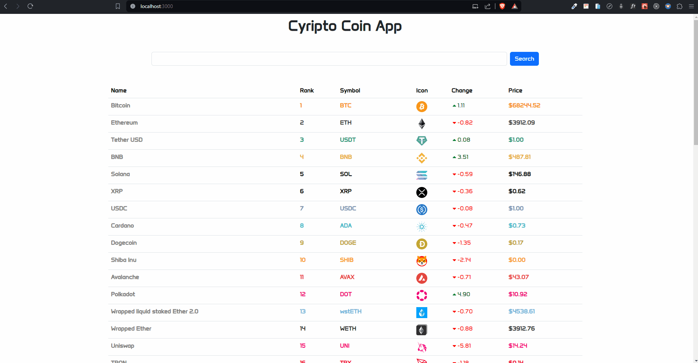
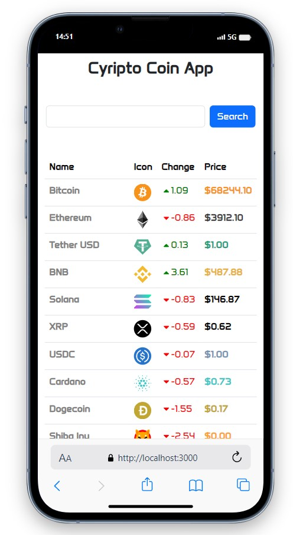
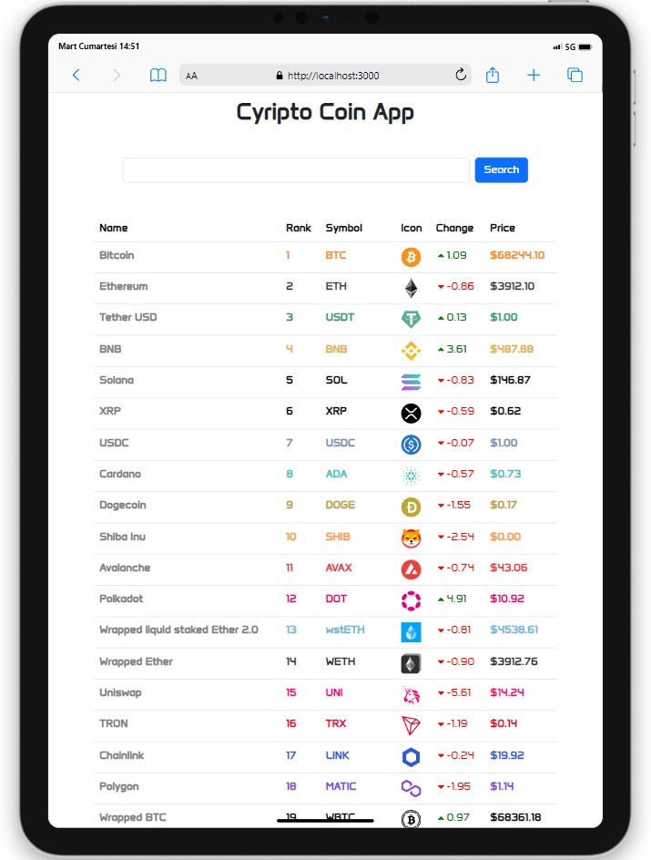
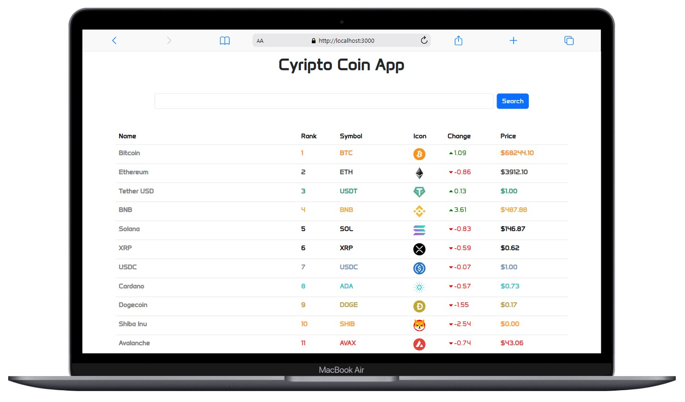

# Crypto Coin App

<div align="center">
  
</div>

## About the Project

This application is a React-based web app that fetches live data for cryptocurrencies and allows users to view details of the cryptocurrency they choose.

## Table of Contents

- [Features](#features)
- [Technologies Used](#technologies-used)
- [Project Skeleton](#project-skeleton)
- [Screenshots](#screenshots)

## Live Demo

[Crypto Coin App]()

## Features

- Users can search for cryptocurrencies through a search box and view their details.
- Details such as ranking, symbol, price, percentage change, etc., of each cryptocurrency are displayed in a table.
- When users select a cryptocurrency, more information can be viewed in a modal window.
- Designed with a user-friendly interface.

## Technologies Used

- React
- Axios for API requests
- [Sweetalert2](https://sweetalert2.github.io/) for alert 
- [Coinranking API](https://api.coinranking.com/v2/coins/) for products data
- Icons from [React Icons](https://react-icons.github.io/react-icons/)
- Styling with [Bootstrap](https://getbootstrap.com/), [React-Bootstrap](https://react-bootstrap.netlify.app/) and CSS

## Project Skeleton

```
Crypto Coin App (folder)
|
|----readme.md         
SOLUTION
├── public
│    └── index.html
├── src
│    ├── assets
│    │     └── [images]
│    ├── components
│    │     ├── Modal.jsx
│    │     ├── Search.jsx          
│    │     └── Table.jsx  
│    ├── pages   
│    │     └── Home.jsx 
│    ├── App.js
│    ├── index.css
│    └── index.js
├── package.json
└── yarn.lock
```

## Screenshots

<div align="center">
  
  
  
</div>

## Compatibility

The project is compatible with both wide-screen computers and mobile devices.
